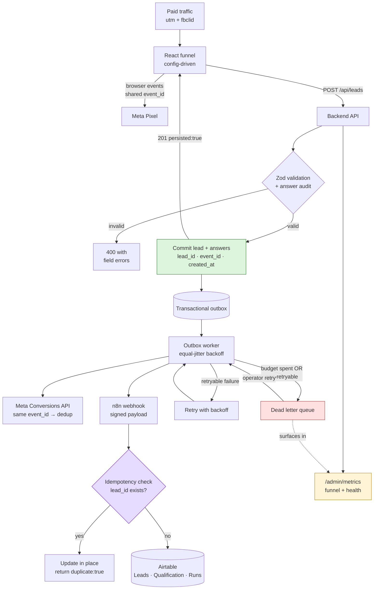

# Disability Benefits Qualification Funnel

A production-minded lead-generation funnel: a config-driven React questionnaire,
a validating Node API, Meta Pixel + Conversions API with shared-event-ID
deduplication, and an n8n → Airtable automation layer that cannot silently lose
a lead.

Built as a take-home. The reference funnel
(`funnel.disabilitypath.org/qualification-v30`) was the UX brief; everything
behind the glass is designed as if it were about to take paid traffic.

```
┌─────────────────────────────────────────────────────────────────────┐
│  160 tests · 0 vulnerabilities · runs end-to-end with no credentials │
└─────────────────────────────────────────────────────────────────────┘
```

---

## Contents

1. [What this is](#1-what-this-is)
2. [Architecture](#2-architecture)
3. [Tech stack](#3-tech-stack)
4. [Funnel flow](#4-funnel-flow)
5. [Tracking strategy](#5-tracking-strategy)
6. [Pixel + CAPI and deduplication](#6-pixel--capi-and-deduplication)
7. [Privacy: the part that matters most](#7-privacy-the-part-that-matters-most)
8. [n8n architecture](#8-n8n-architecture)
9. [Airtable schema](#9-airtable-schema)
10. [Failure recovery strategy](#10-failure-recovery-strategy)
11. [Observability](#11-observability)
12. [Local setup](#12-local-setup)
13. [Environment variables](#13-environment-variables)
14. [Mock mode](#14-mock-mode)
15. [Testing](#15-testing)
16. [Demo scripts](#16-demo-scripts) — failures, dedup, recovery
17. [Configuring the real services](#17-configuring-the-real-services)
18. [Security](#18-security)
19. [Accessibility](#19-accessibility)
20. [Deployment](#20-deployment)
21. [Trade-offs and assumptions](#21-trade-offs-and-assumptions)
22. [What I would do next](#22-what-i-would-do-next)

---

## 1. What this is

A visitor answers up to fifteen questions, one per screen, and becomes a lead.
Behind that, four things have to be true at once:

| Requirement | How it is met |
|---|---|
| **The lead is never lost** | Transactional outbox. The lead commits to our own store *before* any third party is called. |
| **Meta counts each conversion once** | One `event_id` generated in the browser and reused by the server. |
| **Health data never reaches an ad platform** | A deny-by-default allowlist, enforced in shared code used by both tiers. |
| **Failures are visible and replayable** | Every attempt is an `AutomationRun`; dead letters surface in an admin view with a one-click retry. |

The funnel is **data, not code**. Adding a question means adding an object to
[`packages/shared/src/funnel/config.ts`](packages/shared/src/funnel/config.ts).
No new React component, no API change, no Airtable migration.

---

## 2. Architecture



**The single most important arrow** is `E → B`: the API returns success as soon
as the lead is durably committed, *before* Meta or Airtable are called. A third
party being slow cannot delay the user's success screen, and a third party being
down cannot lose the lead.

### Repository layout

```
packages/shared/          Used by BOTH tiers — one definition, no drift
  funnel/config.ts          The 15 questions + branching rules
  funnel/engine.ts          Branching, progression, validation, answer audit
  funnel/qualification.ts   Deterministic scoring
  events.ts                 Event taxonomy + THE PRIVACY ALLOWLIST
  schemas.ts                Zod wire contracts
  ids.ts                    ld_ / evt_ / ses_ id generation

apps/api/
  routes/                   leads · events · admin · health · mock-n8n
  services/
    leadService.ts          Validate → commit → enqueue side effects
    meta/                   CAPI payload builder + client
    n8n/workflow.ts         The workflow, as testable code
    outbox/                 Worker, handlers, backoff, dead-lettering
    metricsService.ts       Funnel + automation health
  store/                    Repository interface over an atomic JSON store
  middleware/               Rate limit · admin auth · errors · request context

apps/web/
  hooks/useFunnel.ts        State machine: autosave, resume, pruning
  tracking/                 The ONLY place fbq is touched
  components/funnel/        One renderer for all 15 questions
  pages/                    Funnel · Success · Admin

n8n/lead-to-airtable.workflow.json   Importable workflow
docs/airtable-schema.md              Table-by-table schema
```

---

## 3. Tech stack

| Layer | Choice | Why |
|---|---|---|
| Frontend | React 19 + TypeScript + Vite 8 | |
| Styling | Tailwind 3 | |
| Animation | **CSS keyframes, no library** | Six short transitions do not justify shipping Framer Motion to a landing page where every KB costs conversions. |
| Backend | Node 20+ / Express 4 / TypeScript | Express 4 over 5 deliberately: the ecosystem and types are settled. |
| Validation | Zod 3 | Shared between tiers, so the browser and server enforce the same contract. |
| Tests | Vitest + Supertest | 160 tests. |
| Automation | n8n | |
| CRM | Airtable | |

**Deliberately not used:** no state-management library (the funnel is one
`useState` machine), no ORM, no queue broker, no logging framework, no icon
package, no `express-rate-limit`. Each would have added dependency surface to
replace ~40 lines of code that is better owned outright — particularly log
redaction, which decides what health data can reach a log stream.

**Version pinning:** TypeScript 5.9 rather than 7, and Zod 3 rather than 4.
Both majors are recent; this code targets the settled APIs.

---

## 4. Funnel flow

```
age_range → receiving_benefits → work_hours → years_employed
    ↓
asset_value                    [skipped if already receiving SSI or both]
    ↓
out_of_work_year → under_medical_care → application_pending
    ↓
    ├── application_pending = yes ──┐
    │     attorney_represented      │
    │       └── = yes → attorney_firm
    │     application_denied        │
    │       └── = yes → appeal_stage
    │     waiting_duration          │
    └── application_pending = no ───┘ (entire block skipped)
    ↓
gender → marital_status → EMAIL → CONTACT (name + phone)
```

Two independent branch families, one of them nested two levels deep, which is
enough to prove the engine without making the config unreadable.

### Design decisions

**Age is asked first**, unlike the reference funnel which asks it near the end.
Age is the single strongest SSDI/SSI qualification signal and is trivial to
answer. Asking it first means we stop spending a user's patience on fourteen
more questions when the outcome is already decided.

**The asset question is skipped for existing SSI recipients.** The $2,000 asset
test only exists for means-tested SSI. Someone already receiving it has passed
that test. Asking anyway signals that nobody is listening.

**Orphaned answers are pruned.** If a user goes back and changes
`application_pending` from yes to no, the attorney answers they already gave are
deleted, not merely hidden. Persisting them would put a factually false record
in the CRM. The pruning cascades, so removing a grandparent removes the whole
subtree ([`pruneOrphanedAnswers`](packages/shared/src/funnel/engine.ts)).

**Everyone reaches the contact form, including disqualified users.** They are
stored with `lead_status: disqualified` and are simply not reported to Meta as a
conversion. Hard-bouncing someone mid-funnel wastes acquisition spend that has
already been committed, and the business still wants the record.

### Qualification

[`evaluateQualification`](packages/shared/src/funnel/qualification.ts) is pure
and deterministic: hard disqualifiers first (work above the SGA threshold, the
12-month duration test, already receiving both programmes), then a 0–100 score.
It emits reason codes (`age_favourable_grid_rules`,
`no_active_medical_evidence`) so a routing decision can always be explained —
and those codes are **never** sent to an ad platform.

---

## 5. Tracking strategy

Components never call `fbq` and never call the events endpoint. They call
`trackEvent({ eventName })` and
[`apps/web/src/tracking/tracker.ts`](apps/web/src/tracking/tracker.ts) decides
the rest from the taxonomy.

| Event | Browser | Server | Meta name | Why |
|---|---|---|---|---|
| `PageView` | ✅ | — | `PageView` | Standard. No server-side value. |
| `ViewContent` | ✅ | — | `ViewContent` | Funnel screen rendered. |
| `FunnelStarted` | ✅ | — | custom | First question answered. |
| `QuestionCompleted` | — | — | **none** | High volume, low signal — and the payload would necessarily describe *which health question* was answered. |
| `QualificationStarted` | — | — | **none** | Question one *rendered*. Paired with `FunnelStarted` (question one *answered*) it measures the "saw it, never engaged" cohort — the biggest single drop in a quiz funnel, and usually invisible. |
| `QualificationCompleted` | — | ✅ | custom | Server-only so an ad blocker cannot suppress it. Carries no answer detail. |
| `EmailCaptured` | ✅ | ✅ | `CompleteRegistration` | **Dual-sent, shared `event_id`.** |
| `Lead` | ✅ | ✅ | `Lead` | **Dual-sent, shared `event_id`.** The primary conversion. |

Our own store receives **every** event, including the ones Meta never sees.
That asymmetry is the point: complete internal funnel analytics, a deliberately
thin external slice.

### Three decisions worth defending

**1. Disqualified leads are not reported as `Lead`.** Meta optimises toward
whatever you call a conversion. Reporting unqualified leads teaches the
algorithm to find more unqualified people — you buy your own worst traffic. Only
`qualified` and `review` outcomes fire the conversion.

**2. A modelled `value` is attached.** `qualified` = $120, `review` = $45. Value
lets Meta bid toward lead *quality*, not lead volume. These are placeholders; in
production they come from closed-won CRM data.

**3. `fbc` is reconstructed from a raw `fbclid`.** When a user lands with
`?fbclid=` but the Pixel has not yet written the `_fbc` cookie (ad blocker, slow
script, JS disabled), the server synthesises `fb.1.{timestamp}.{fbclid}`. Three
lines that recover attribution which would otherwise be lost outright
([`buildFbc`](apps/api/src/services/meta/payload.ts)).

---

## 6. Pixel + CAPI and deduplication

Meta deduplicates when the browser event and the server event share **both** the
same `event_name` and the same `event_id`. Get it wrong and you either
double-count every conversion or lose half of them.

```
Browser                                   Server
───────                                   ──────
event_id = evt_abc123  ◄── generated once, in the browser
    │
    ├─ fbq('track','Lead',…,{eventID:'evt_abc123'})
    │        │
    │        └──────────────► Meta ◄─────────────┐
    │                                            │
    └─ POST /api/leads  ─────────────────────────┤
         { client: { event_id:'evt_abc123',      │
                     pixel_fired: true } }       │
              │                                  │
              └─► outbox ─► CAPI                 │
                     event_id = evt_abc123 ──────┘

                  Meta sees the same event_name + event_id twice
                                    ↓
                           counts it ONCE
```

Why the browser mints the id: the Pixel copy is sent from the browser, so the id
must exist there first. The server reuses whatever the client supplied
(validated for shape, never trusted for anything security-sensitive) and only
mints its own if the browser never produced one.

`pixel_fired` is forwarded so the backend knows whether the browser copy
actually went out. If an ad blocker stopped it, the server copy is the *only*
copy — and Meta still receives exactly one event.

**Match quality.** Every identifier we legitimately hold is normalised to Meta's
rules and SHA-256 hashed server-side: email (lowercased, trimmed), phone (digits
with country code — a bare 10-digit US number gets a `1` prefix), first name,
last name, gender (reduced to `m`/`f`; anything else omitted rather than
guessed), plus unhashed `fbp`, `fbc`, client IP and user agent. Empty values are
dropped entirely rather than hashed — hashing `''` produces a valid-looking
digest that matches nobody and drags reported match quality down.

The live demo produces **8 match keys** on a single lead.

---

## 7. Privacy: the part that matters most

This funnel collects disability, medical and financial information. Sending it
to an advertising platform would be a serious privacy failure, a breach of
Meta's own prohibition on health data, and likely unlawful under US state health
privacy statutes.

The defence is one allowlist, in shared code, used by **both** tiers:

```ts
// packages/shared/src/events.ts
export const META_ALLOWED_CUSTOM_PARAMS = new Set([
  'content_name', 'content_category', 'currency', 'value',
  'funnel_version', 'lead_quality', 'step_number',
]);
```

Note what is absent: every question id, every answer value, the qualification
reason codes, and the numeric score. Meta receives `lead_quality: 'priority'` —
a coarse bucket — and nothing else about the person's health.

**Deny by default.** `sanitiseMetaCustomData` drops anything not explicitly
listed and returns the dropped keys, which are logged as a warning. Adding
question sixteen cannot leak, because a new key is simply not in the allowlist.
There is a test asserting that **no funnel question id may ever appear in the
allowlist**.

The one exception is `gender`, used as a hashed Advanced Matching key. It is
demographic, not health, information, Meta supports it as a matching parameter,
and it never appears as a custom parameter.

Four more layers:

- **The events endpoint cannot carry an answer.** Its schema accepts a
  `question_id` and a `step_number` — an id is not an answer — and Zod strips
  everything else. A crafted beacon with `{answer: 'yes', diagnosis: '…'}` is
  silently discarded (there is a test).
- **Logs are redacted at the logger.** PII keys are masked; `answers` is dropped
  wholesale and replaced with a count. Health data cannot reach the log stream
  even at debug level.
- **Raw IPs are not retained.** The IP is used once for the Meta call, then only
  a SHA-256 hash is stored.
- **The admin dashboard masks contacts.** `da****@example.com`, `Dana W.` — an
  ops view answers "did this sync?" without displaying a contact list.

---

## 8. n8n architecture

```
Webhook (POST /webhook/lead-to-airtable)
  ↓
Verify HMAC signature        ← n8n webhooks are unauthenticated by default
  ↓
Validate payload + schema_version
  ↓
Idempotency: search Leads by lead_id
  ↓
  ├─ found    → update in place → log run → respond 200 {duplicate:true}
  └─ not found → create Lead → split answers → create Qualification rows
                  → log run → respond 200 {duplicate:false}
```

Import [`n8n/lead-to-airtable.workflow.json`](n8n/lead-to-airtable.workflow.json)
(15 nodes) and set `N8N_FUNNEL_WEBHOOK_SECRET` plus `AIRTABLE_BASE_ID` in the
n8n environment.

### Idempotency

`lead_id` is the key. Airtable has **no unique constraints**, so the check must
be explicit and must run before any write. A replay updates the existing record
rather than ignoring it — a retry carries the freshest data, and an operator
would rather have a corrected record than a second one.

**A duplicate returns HTTP 200, not an error.** A replay is the expected outcome
of an at-least-once delivery system. Returning an error would make the caller's
outbox retry forever.

**Status codes are a contract.** The workflow returns 4xx for a malformed
payload (never retryable — dead-letter it immediately) and 5xx for a downstream
failure (retryable — back off and try again). The outbox reads the status to
decide, so getting this wrong either loses leads or wastes retry budget.

### Why the workflow also exists as code

[`apps/api/src/services/n8n/workflow.ts`](apps/api/src/services/n8n/workflow.ts)
is the executable source of truth, used by two callers:

1. `routes/mockN8n.ts` exposes it over HTTP, so the real client calls it exactly
   as it would call a live n8n instance — signature, status codes and all.
2. The n8n client calls it in-process when n8n itself is mocked.

Two reasons. An interviewer cannot be asked to stand up an n8n instance to see
the system work. And **a workflow you cannot test is a workflow you cannot
trust** — the idempotency behaviour here is covered by 14 automated tests
rather than by hope. The exported JSON is the importable mirror of these steps.

Point `N8N_WEBHOOK_URL` at a real instance and the simulator is simply unused.

---

## 9. Airtable schema

Four tables — `Leads`, `Qualification`, `Events`, `Automation Runs`. Full
field-by-field definitions in [`docs/airtable-schema.md`](docs/airtable-schema.md).

The notable choice: answers are stored **one row per question**
(Entity-Attribute-Value) rather than one column per question. A funnel changes
weekly; with a wide table, every new question is an Airtable schema change, an
n8n mapping change and a backfill. With a tall table, adding question sixteen is
a config edit and nothing else moves. The cost is that reporting needs a pivot —
the right trade for a funnel still being optimised.

---

## 10. Failure recovery strategy

**The design rule: a lead is never at the mercy of a third party.**

The obvious implementation — call Meta and Airtable inline during the request —
fails badly. A slow Airtable makes the user wait; a down Airtable either loses
the lead or shows an error to someone who has just answered fifteen questions.

Instead, a **transactional outbox**:

```
1. Validate           Zod + server-side answer audit
2. COMMIT             lead + answers → durable store   ← past here, nothing is lost
3. Enqueue            meta_capi, lead_to_airtable → outbox
4. Return 201         { persisted: true }
5. Worker delivers    asynchronously, with retries
```

### Retries

Exponential backoff with **equal jitter**: `delay/2 + random() × delay/2`,
doubling from 1s to a 5-minute cap.

Equal jitter, not full jitter, and that is a bug I hit and fixed during
development. Full jitter (`random() × delay`) can return a delay of nearly zero,
so a job becomes due again immediately and a single drain pass burns the entire
retry budget in milliseconds — before the downstream has any chance to recover.
Equal jitter keeps half the delay as a guaranteed floor and randomises the rest,
so retries are both spread out *and* genuinely delayed. A drain pass also
attempts each job at most once, as a second guard.

### Failure classification

Not every failure deserves a retry.

| Failure | Retryable? | Behaviour |
|---|---|---|
| 5xx, timeout, network error | ✅ | Back off and retry |
| 429 | ✅ | Explicitly temporary |
| 4xx from n8n (bad payload) | ❌ | Dead-letter immediately |
| Lead no longer exists | ❌ | Dead-letter immediately |
| Event older than Meta's 7-day window | ❌ | Dead-letter — Meta would reject it |
| Meta `is_transient: false` | ❌ | Trust Meta's own classification |

Retrying a permanently-broken job is not resilience, it is noise that hides the
jobs which could actually succeed.

### Dead letters

When the budget is spent or the error is permanent, the job moves to
`dead_letter`. It is **not** deleted. It appears in `/admin/jobs`, in the
metrics, and as `status: degraded` on `/ready`, with a one-click **Retry**.
Because the job carries its original dedupe key and the downstream is idempotent,
replaying a job that actually did succeed is safe — it updates rather than
duplicating.

### The UI never lies

The success page distinguishes three states, because they are genuinely
different:

| State | What the user sees |
|---|---|
| Persisted + synced | "Submission confirmed" ✅ |
| Persisted, sync in flight | "Your answers are saved. Final processing is still completing." |
| Persisted, sync dead-lettered | "Your answers are saved. One of our internal systems is running behind, so our team has been alerted and will process your file manually." + phone number |

Never a green tick over a failure. `/api/leads/:id/status` exists precisely so
the page can tell the truth.

### Isolation

The two side effects are independent jobs. Meta being down does not stop the CRM
write, and vice versa — verified by test.

---

## 11. Observability

`/admin` (React) and `GET /admin/metrics` (JSON) answer two distinct questions:

**Is the funnel converting?** — visitors, saw question one, answered question
one, qualification completed, email captured, leads submitted, step-by-step
conversion rates, a per-question drop-off table (built from the internal-only
`QuestionCompleted` events), and the qualified / review / disqualified split.

The "saw question one" versus "answered question one" pair is the row most
funnels never measure: people who loaded the page, read the first question and
left. It is usually the largest single loss in the whole funnel.

**Is anything broken right now?** — Meta events succeeded and failed, Airtable
writes succeeded and failed, retries pending, dead letters, duplicates
prevented, leads awaiting CRM sync, and the age of the oldest pending job.

Actual output after `npm run seed:demo 30` (30 simulated visitors, all figures
copied from a real run, not illustrative):

```
Visitors                   30      Meta events sent           44
Funnel started             28      Meta events failed          0
Email captured             17      Airtable writes            13
Lead submitted             13      Retries pending             0
Qualified                  10      Dead letter                 0
Disqualified                3      Duplicates prevented        4

visit → start  93.3%    start → email  60.7%    email → lead  76.5%
visit → lead   43.3%    lead qualification rate 76.9%
```

The `4` duplicates prevented are the seeder's simulated network retries — each
one would otherwise have been a second lead *and* a second Meta conversion.

Conversion rates are clamped to 100%, and that clamp is not cosmetic.
Top-of-funnel counts come from browser beacons, which are lost to ad blockers,
rate limits and closed tabs. Lead counts come from server-authoritative records
and are never lost. A step rate can therefore legitimately exceed 100% when a
beacon goes missing, and rendering "118%" in an ops dashboard reads as a bug
rather than the measurement artefact it is. `funnel_started` counts sessions
emitting `FunnelStarted` **or** `QuestionCompleted`, so one lost beacon does not
distort the number.

Logs are structured JSON, one line per event, redacted at the logger, with a
`request_id` propagated through every layer.

---

## 12. Local setup

Requires Node 20.10+ (built and tested on Node 24).

```bash
git clone <repo> && cd Assignment
npm install
cp .env.example .env     # works as-is — no credentials needed
npm run dev              # API on :4000, funnel on :5173
```

Open:

| URL | |
|---|---|
| <http://localhost:5173> | The funnel |
| <http://localhost:5173/admin> | Operations dashboard |
| <http://localhost:4000/ready> | Readiness + integration status |

Populate the dashboard with realistic data:

```bash
npm run seed:demo 40     # simulates 40 visitors with realistic drop-off
```

The seeder drives the real HTTP API, so everything it produces has been through
validation, qualification, the outbox and the workflow. It also respects
`Retry-After` when rate limited — the limits stay at their production values
rather than being loosened for a demo.

Other commands:

```bash
npm test             # 160 tests
npm run test:watch
npm run typecheck    # all three workspaces
npm run build        # production build
```

---

## 13. Environment variables

Full annotated list in [`.env.example`](.env.example). The ones that matter:

| Variable | Default | Notes |
|---|---|---|
| `PORT` | `4000` | |
| `CORS_ALLOWED_ORIGINS` | `http://localhost:5173` | Comma-separated. |
| `META_PIXEL_ID` | — | Public. Also set `VITE_META_PIXEL_ID`. |
| `META_ACCESS_TOKEN` | — | **Server-side only.** Never `VITE_`-prefixed. |
| `META_TEST_EVENT_CODE` | — | Remove in production — it diverts conversions into the test stream. |
| `N8N_WEBHOOK_URL` | local simulator | |
| `N8N_WEBHOOK_SECRET` | `local-dev-secret` | Must match n8n's `N8N_FUNNEL_WEBHOOK_SECRET`. |
| `AIRTABLE_TOKEN` / `AIRTABLE_BASE_ID` | — | |
| `ADMIN_API_TOKEN` | `local-admin-token` | Guards `/admin/*`. Typed into the dashboard at runtime — there is deliberately **no** `VITE_ADMIN_TOKEN`, because a `VITE_`-prefixed variable is inlined into the public bundle. |
| `RATE_LIMIT_MAX_LEADS` | `10` / min / IP | |
| `RATE_LIMIT_MAX_EVENTS` | `600` / min / IP | Deliberately generous: a 15-step funnel emits ~20 beacons per user and corporate NAT means many users share one IP. Too tight a limit silently deletes analytics. |
| `OUTBOX_MAX_ATTEMPTS` | `5` | |

Only `VITE_`-prefixed variables reach the browser bundle — the structural
guarantee that the Meta access token stays server-side.

---

## 14. Mock mode

`MOCK_MODE=true` (the default) makes every outbound integration simulated and
logged, so the whole system runs with an empty `.env`. Per-integration switches
(`MOCK_META`, `MOCK_N8N`, `MOCK_AIRTABLE`) let you go live one service at a
time; each also auto-mocks when its credentials are missing, so the app never
half-starts against a service it cannot reach.

Mock mode is not a stub. The mocked n8n client runs the **real workflow** in
process: the idempotency probe executes, the mock Airtable tables are actually
written, and an injected Airtable failure propagates up exactly as a real outage
would. That is what makes the demos below meaningful.

The Meta mock logs the exact payload that would be sent:

```json
{"msg":"meta.capi_mock_send","event_name":"Lead","event_id":"evt_livedemo0000001",
 "match_keys":["em","ph","fn","ln","ge","fbc","client_ip_address","client_user_agent"],
 "custom_data":{"content_name":"disability-qualification","lead_quality":"priority",
                "value":120,"currency":"USD","funnel_version":"qualification-v1"}}
```

Eight match keys, and nothing sensitive in `custom_data`.

### Failure injection

`MOCK_AIRTABLE_FAILURE`, `MOCK_N8N_FAILURE`, `MOCK_META_FAILURE` and a
probabilistic `MOCK_FAILURE_RATE`, all toggleable **at runtime** from the admin
dashboard or `POST /admin/failure-injection` — no restart, so the reliability
story can be demonstrated live.

---

## 15. Testing

```
160 tests across 8 files

packages/shared
  engine.test.ts      33  branching, pruning, progression, validation, answer audit
  tracking.test.ts    23  taxonomy, privacy allowlist, qualification, id collisions

apps/api
  leads.test.ts       27  validation, idempotency, concurrency, rate limit, admin auth
  reliability.test.ts 18  retries, dead letters, recovery, backoff, isolation
  meta.test.ts        26  hashing, fbc reconstruction, dedup, privacy, log redaction
  workflow.test.ts    14  signature, validation, idempotency, partial-write safety
  funnel-journey.test.ts 4  full journeys: qualified, denied-branch, disqualified, outage

apps/web
  useFunnel.test.ts   15  state machine, autosave, resume, branch pruning
```

Covering every item the brief asked for: branching logic, question progression,
lead validation, event ID generation, idempotency, duplicate webhook handling,
Meta event payload creation and failed automation handling.

Tests are hermetic — in-memory store, every integration mocked, no network, with
environment set in `vitest.config.mts` so a developer's local `.env` can never
change what CI asserts. The suite runs in **under a second**.

**On flakiness.** The suite failed roughly one run in five under CPU load, with
nonsense statuses — a `POST /api/leads` answered `401`, or `404`. The cause was
supertest binding a fresh ephemeral port per request: under contention those
ports recycle fast enough that a connection can land on one a closing server
still holds, delivering an earlier test's response to a later request. Each API
test file now binds **one** server for its lifetime (`listenOnce`). Verified
with 12 consecutive clean runs under the same six-core load that previously
reproduced it. A flaky suite is worse than no suite — it trains people to
re-run until green.

A few worth calling out:

- **`never allowlists a real question id`** — iterates the funnel config and
  asserts no question id can appear in the Meta allowlist. Structural, so it
  keeps holding as the funnel grows.
- **`survives concurrent duplicate submissions`** — five simultaneous identical
  requests produce exactly one lead.
- **`writes nothing when the idempotency probe itself fails`** — no partial
  write, which is what makes the retry safe.
- **`never attempts the same job twice in one drain pass`** — regression guard
  for the jitter bug described in §10.
- **`keeps the user experience intact when the whole automation layer is down`**
  — the full outage-to-recovery journey in one test.

---

## 16. Demo scripts

Start with `npm run dev`. Every command below works with **no credentials**.

<details open>
<summary><b>A. Demonstrate deduplication</b></summary>

```bash
# Submit a lead with an explicit event_id
curl -s -X POST localhost:4000/api/leads -H 'content-type: application/json' -d '{
  "contact":{"first_name":"Dana","last_name":"Whitfield","email":"dana@example.com","phone":"(415) 555-0132"},
  "answers":{"age_range":"55_63","receiving_benefits":"none","work_hours":"not_working",
             "years_employed":"over_6","asset_value":"under_2000","out_of_work_year":"yes",
             "under_medical_care":"yes","application_pending":"no","gender":"female","marital_status":"married"},
  "attribution":{"utm_source":"facebook","fbclid":"IwAR0Demo","funnel_version":"qualification-v1"},
  "client":{"session_id":"ses_demo0000000001","event_id":"evt_demo00000000001","pixel_fired":true}}'
```

→ `201` · `"event_id":"evt_demo00000000001"` — the **browser's** id, reused by
the server. That is the dedup key Meta will use.

Now send the identical request again:

→ `200` · `"replayed":true` · **same `lead_id`, same `job_id`s**. One lead, one
conversion, no duplicate jobs.

</details>

<details>
<summary><b>B. Demonstrate failure, retry and recovery</b></summary>

```bash
A='x-admin-token: local-admin-token'

# 1. Break Airtable
curl -s -X POST localhost:4000/admin/failure-injection -H "$A" \
  -H 'content-type: application/json' -d '{"integration":"airtable","enabled":true}'

# 2. Submit a lead during the outage (reuse the body from demo A, new email + event_id)
#    → still 201, "persisted": true — the user sees success because the lead IS saved

# 3. Watch it retry, then dead-letter
watch -n2 'curl -s "localhost:4000/admin/jobs" -H "x-admin-token: local-admin-token" | python3 -m json.tool | head -30'
```

Observed live:

```
lead_to_airtable   failed       attempts=4/5   err=HTTP 502 …
meta_capi          succeeded    attempts=1/5          ← isolated: Meta unaffected
...
lead_to_airtable   dead_letter  attempts=5/5

GET /ready → {"status":"degraded","dead_letter":1}    ← still HTTP 200
```

`/ready` stays 200 deliberately: a delivery problem must not take the
revenue-generating funnel offline.

```bash
# 4. Heal the downstream, then retry from the dashboard (or by API)
curl -s -X POST localhost:4000/admin/failure-injection -H "$A" \
  -H 'content-type: application/json' -d '{"integration":"airtable","enabled":false}'
curl -s -X POST localhost:4000/admin/jobs/<job_id>/retry -H "$A"
```

→ `"status":"succeeded"` · lead `synced_to_crm: true` · **one** Airtable record.
Metrics return to `dead_letter: 0`.

Or do the whole thing by clicking in `/admin` — toggle `airtable: FAILING`,
submit through the funnel, watch the row go red, toggle back, hit **Retry**.

</details>

<details>
<summary><b>C. Demonstrate the privacy boundary</b></summary>

```bash
# Try to smuggle health data through the telemetry beacon
curl -s -X POST localhost:4000/api/events -H 'content-type: application/json' -d '{
  "event_name":"QuestionCompleted","event_id":"evt_smuggle00000001",
  "session_id":"ses_demo0000000001","question_id":"under_medical_care",
  "answer":"yes","diagnosis":"severe back injury"}'

# Then inspect what was stored
curl -s "localhost:4000/admin/events?limit=1" -H 'x-admin-token: local-admin-token'
```

→ `answer` and `diagnosis` are gone. The schema physically cannot carry them.

Then grep the API log for `meta.capi_mock_send` and confirm `custom_data`
contains only allowlisted keys — no answers, no score, no reason codes.

</details>

<details>
<summary><b>D. Demonstrate branching</b></summary>

In the funnel, answer **"Do you have a pending SSD application?" → No**. The
attorney, denial, appeal and waiting-time questions never appear, and the step
count shrinks.

Answer **Yes**, continue to the attorney questions, then press **Back** and
change it to **No** — the answers you already gave are pruned, not merely
hidden, so they never reach the CRM as false facts.

</details>

---

## 17. Configuring the real services

<details>
<summary><b>Meta</b></summary>

1. Events Manager → your pixel → copy the **Pixel ID** into `META_PIXEL_ID` and
   `VITE_META_PIXEL_ID`.
2. Settings → Conversions API → **Generate access token** → `META_ACCESS_TOKEN`.
   Server-side only; never give it a `VITE_` prefix.
3. Set `META_CAPI_ENABLED=true` and `MOCK_META=false`.
4. **Validate before trusting it.** Test Events → copy the test code into
   `META_TEST_EVENT_CODE`, run the funnel, and confirm each conversion appears
   **once** with "Deduplicated" against the browser event. Then remove the test
   code — leaving it set silently diverts production conversions into the test
   stream.
5. Check Event Match Quality in Events Manager. Below ~6.0 usually means `fbp` /
   `fbc` are missing, not that the hashing is wrong.

</details>

<details>
<summary><b>n8n</b></summary>

1. Import `n8n/lead-to-airtable.workflow.json`.
2. Add Airtable credentials to the four Airtable nodes.
3. Set `N8N_FUNNEL_WEBHOOK_SECRET` and `AIRTABLE_BASE_ID` in the n8n environment.
4. Activate, copy the production webhook URL into `N8N_WEBHOOK_URL`, set
   `N8N_WEBHOOK_SECRET` to the same secret, and `MOCK_N8N=false`.
5. Verify with a funnel submission: the execution log should show
   `Idempotency: Find Lead → Already Exists? (false) → Create Lead`. Submit the
   same lead again and confirm it takes the `true` branch instead.

</details>

<details>
<summary><b>Airtable</b></summary>

Follow [`docs/airtable-schema.md`](docs/airtable-schema.md) — four tables, exact
field names. Create a scoped personal access token
(`data.records:read`, `data.records:write`), set `AIRTABLE_TOKEN` and
`AIRTABLE_BASE_ID`, then `MOCK_AIRTABLE=false`.

</details>

---

## 18. Security

- **Server-side validation of everything.** Zod on every endpoint, plus an
  *answer audit* that rejects unknown question ids, option values not in the
  config, and answers to questions the branching rules say the user could never
  have been shown. A crafted payload cannot poison the CRM with an impossible
  combination.
- **Input sanitisation.** Control characters and angle brackets stripped. React
  escapes on render, but this data also lands in Airtable, in email and in Slack
  alerts, where escaping is not automatic.
- **Rate limiting** per IP, per endpoint class, with `Retry-After`.
- **CORS allowlist**, rejected origins logged.
- **Helmet** security headers; `x-powered-by` disabled.
- **64 KB body limit.**
- **Signed n8n webhook** — closes the default-unauthenticated n8n hole.
- **Constant-time comparison** for the admin token and webhook signature.
- **`trust proxy` set to exactly one hop in production** — trusting all hops
  lets a client forge `X-Forwarded-For` and bypass rate limiting.
- **No secret in the browser bundle** — only `VITE_`-prefixed variables are
  inlined, and neither the Meta access token nor the admin token is one of them.
  The admin token is typed into `/admin` and held in `sessionStorage` for that
  tab; shipping it as `VITE_ADMIN_TOKEN` would have handed it to every visitor
  who loaded the funnel, which is worse than no token because it *looks*
  protected.
- **Contact PII is kept out of the answers table** — `email` and the contact
  step are stored as first-class lead columns and excluded from the
  `Qualification` table, so the one table holding health answers does not also
  become a contact list.
- **Errors never leak internals** in production; every response carries a
  `request_id` for correlation.

---

## 19. Accessibility

The audience for a disability benefits funnel skews older and is
disproportionately likely to use assistive technology. This is not a
box-ticking section.

- Real `<button>` elements throughout — never a clickable `<div>`.
- Options form a labelled `radiogroup` with `aria-pressed`; arrow keys move
  between them and wrap, matching native radio behaviour.
- Focus moves to the question heading on each step, with `preventScroll` so the
  viewport does not jump.
- A single consistent `:focus-visible` ring — visible for keyboard users,
  absent on mouse click.
- A real `progressbar` role with `aria-valuetext` ("Step 5 of 12, 40 percent
  complete"), so screen reader users get the same "how much longer?" signal.
- Errors use `role="alert"` and `aria-describedby`; submitting an invalid form
  moves focus to the first problem.
- Correct `autoComplete` tokens on every field, and `inputMode`/`enterKeyHint`
  so mobile keyboards are right first time. Autofill is worth more to this
  audience than any amount of visual polish.
- `prefers-reduced-motion` respected — vestibular disorders are common here.
- Skip link, semantic landmarks, 60px touch targets (above the 44px minimum).
- Progress never moves backwards, even when branching shortens the path: a bar
  that jumps back reads as "you have made things worse".

---

## 20. Deployment

| Piece | Where | Notes |
|---|---|---|
| `apps/web` | Any static host (Vercel, Netlify, CloudFront) | `npm run build` → `dist/`. Needs an SPA rewrite to `index.html`. |
| `apps/api` | Container host (Fly, Render, ECS, Cloud Run) | `npm run build && npm start`. Health `/health`, readiness `/ready`. |
| n8n | n8n Cloud or self-hosted | |
| Airtable | Hosted | |

**Before real traffic, two changes are required** (both are deliberate take-home
simplifications, see §21):

1. **Replace the JSON store with Postgres.** Everything above it uses the
   repository interface, so this is a single-module change.
2. **Run the outbox worker as a separate process** so API instances stay
   stateless and horizontally scalable. The worker is already isolated behind
   `startOutboxWorker()`.

Then: move rate limiting to Redis or the edge, put `/admin` behind SSO, ship
logs to a real aggregator, and alert on `dead_letter > 0` and
`leads_awaiting_crm_sync` — those two are the "leads are being captured but not
delivered" signal, the most expensive failure this system can have.

---

## 21. Trade-offs and assumptions

**Assumptions made** (per the brief, documented rather than asked):

- US-only audience — phone validation and normalisation assume `+1`.
- `$4,152/month` is the SSA maximum, presented as the reference funnel does.
- Lead values ($120 / $45) are placeholders for closed-won CRM data.
- Qualification thresholds encode real SSA criteria (SGA, the 12-month duration
  test, grid rules) but are not legal advice and would be tuned with the
  compliance team.
- Everyone reaches the contact form; qualification affects routing and Meta
  reporting, not access.
- `gender` is the only questionnaire answer permitted to reach Meta, hashed, as
  an Advanced Matching key.

**Deliberate trade-offs:**

| Choice | Trade-off |
|---|---|
| **File-backed JSON store** | Not a production database. Chosen so the entire reliability architecture — outbox, retries, dead letters, idempotency — is demonstrable on a laptop with zero infra. Writes are serialised through a promise chain and made atomic via temp-file + `rename`, because the outbox's correctness depends on it. Behind the repository interface; swapping in Postgres moves no business logic. |
| **In-process outbox worker** | A single deployable is right for a take-home. Correct answer at scale is a separate process or a real queue; the boundary is already clean. |
| **In-memory rate limiter** | Per-instance, so the effective limit multiplies by replica count. Fine for one instance; behind several this moves to Redis or the edge. |
| **Static admin token, entered at runtime** | Right weight for an internal ops view here; it is never compiled into the bundle. Production puts `/admin` behind company SSO instead. |
| **Soft duplicate detection by email** | A repeat email is flagged `duplicate` and suppressed from Meta, but still stored — a genuine second enquiry is worth seeing. A time window would refine this. |
| **`totalSteps` is an estimate** | Branching makes the true length unknowable until the last branch resolves. We show the current path length and clamp the bar so it never regresses. |
| **Progress bar hidden on the email step** | That screen is a results reveal, and a progress bar there competes with the CTA. |

---

## 22. What I would do next

In rough order of value:

1. **Postgres + a real queue** (BullMQ/SQS). The two changes that make this
   genuinely production-ready. ~a day.
2. **Alerting.** `dead_letter > 0` and `leads_awaiting_crm_sync > N` to
   PagerDuty. The dashboard shows the problem; nothing currently wakes anyone.
3. **A/B testing on the funnel config.** The config-driven design already makes
   variants cheap — add a variant resolver, stamp `funnel_version` on each lead
   (already stored), and the analysis is a group-by. This is the highest-leverage
   *growth* feature here.
4. **Abandonment recovery.** `EmailCaptured` already fires before the contact
   form; wiring it to a drip sequence recovers the largest single drop in the
   funnel.
5. **Offline conversion upload.** Push closed-won outcomes from the CRM back to
   Meta so bidding optimises on revenue rather than on form fills. `fbclid` and
   `conversion_event_id` are already stored for exactly this.
6. **Consent management.** A CMP gating the Pixel, with server-side events
   respecting the consent signal. Required for any EU traffic; not needed for a
   US-only funnel, which is why it is not built.
7. **Visual regression + E2E.** Playwright across the real browser funnel, and
   an axe-core pass in CI.
8. **Real per-question analytics.** Time-on-question and back-button rate, to
   find which questions confuse people rather than only where they leave.
